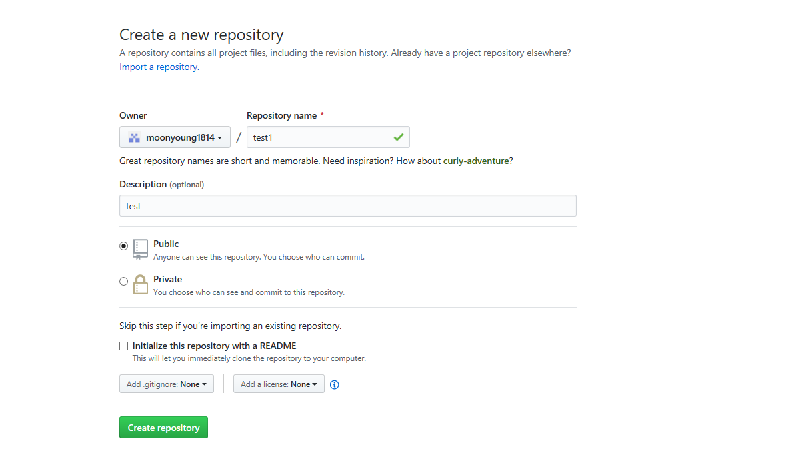

# 部署

## 发布到GitHub pages

GitHub Pages 是 GitHub 提供的静态网站托管服务，GitHub上面的每一个仓库都可以拥有一个GitHub Pages，对应的URL如下：

```
https://<username>.github.io/<repository>/
```

### 第一步 创建一个新的仓库

打开GitHub，新建一个仓库，填写好仓库的名称以及仓库的简介，如下图所示：




### 第二步 在本地生成电子书

编写好电子书后，在命令行中执行下面的命令，就可以将电子书的内容制作成静态网页，并将文件保存在docs目录中

```
$ gitbook build ./ ./docs
```

> 最新的github pages 似乎不再支持git-pages分支，但仍然支持 master 分支的 /docs 目录，因此请将生成后的文档放置于 /docs 目录


### 第三步  结合 GitHub Pages

首先在当前目录新建一个Git代码库，命令行中输入如下命令:

```
$ git init
```

执行后，当前目录会生成一个叫.git的隐藏文件夹。可以输入下面的命令查看当前目录有没有成功生成该文件夹：

```
$ ls -la
```


初始化好以后，就可以输入如下命令来添加第一步中创建好的仓库了

```
$ git remote add origin <URL>
```

其中，URL为刚刚创建好的仓库地址加上后缀.git，仓库的地址是

```
https://github.com/<username>/<repository>
```

例如，本书中第一步创建的仓库就可以用下述命令来添加

```
$ git remote add origin https://github.com/moonyoung1814/test1.git
```


接下来将本地代码库中的所有文件添加到暂存区：

```
$ git add . 
```


添加注释：

```
$ git commit -m 'test'
```

后面引号中的部分即为注释内容。


完成了上述所有步骤以后，就可以将本地文件推送到GitHub上面了：

```
$ git push -u origin master
```

该过程中可能会提示用户要输入GitHub的账号和密码


打开浏览器，进入仓库，会发现本地文件已经完全同步到仓库里面了。选择settings，找到GitHub Pages部分，在source中选择master branch/docs folder，如下图所示：


之后稍等片刻，刷新浏览器，会发现系统提示说网站已经成功部署。点开上面的链接，即可看到发布后的电子书了。